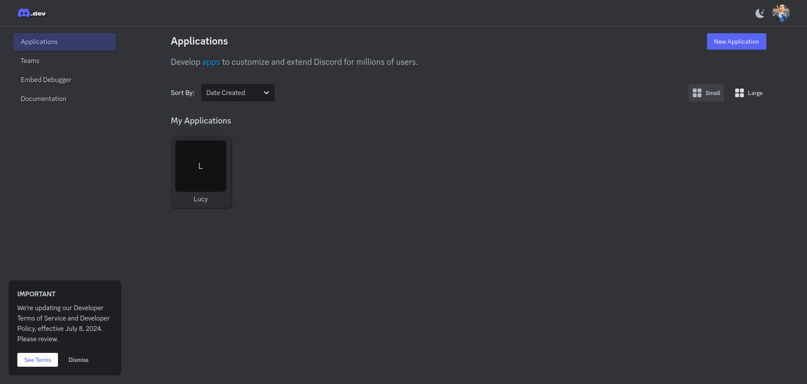
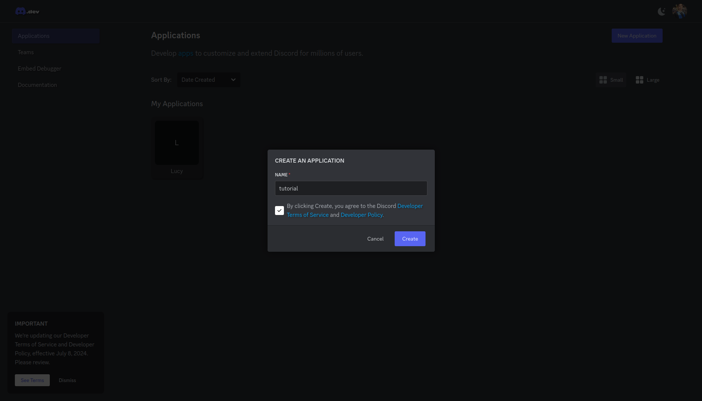
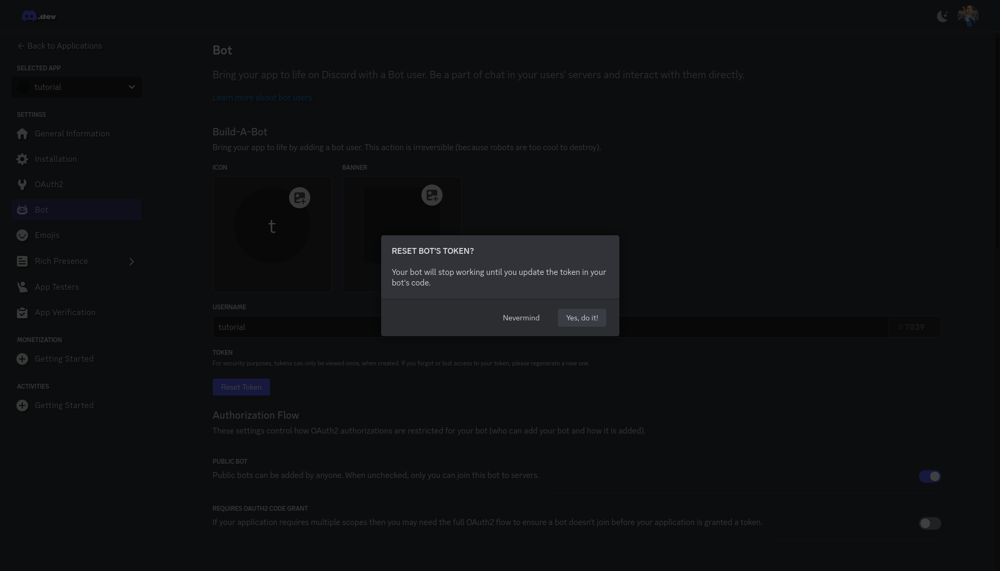
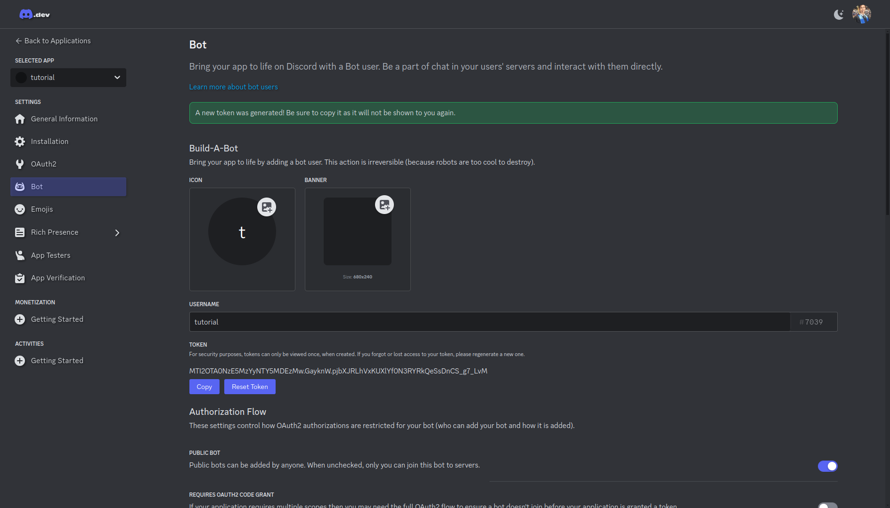
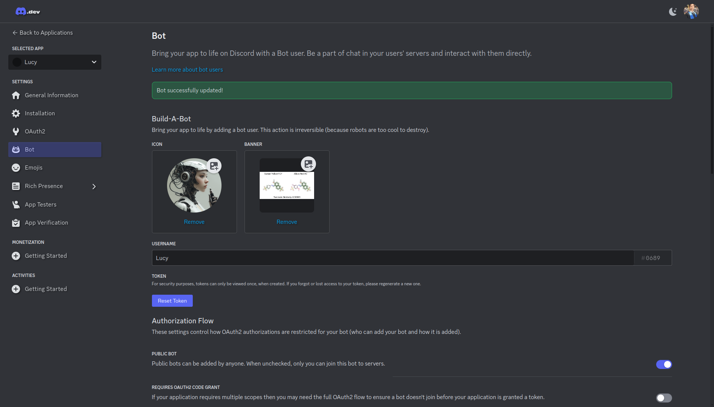
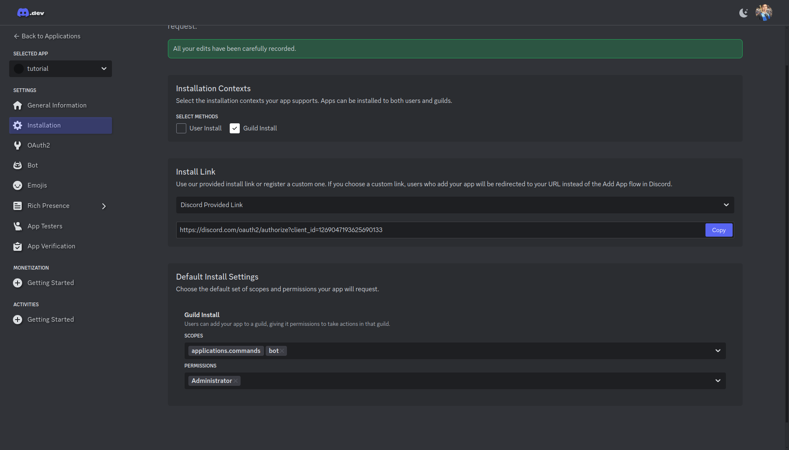
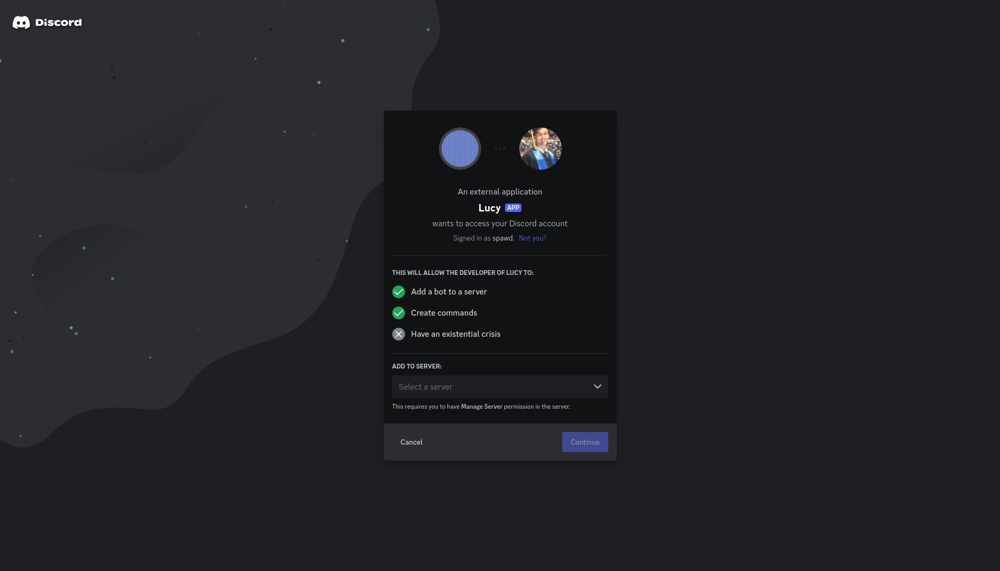
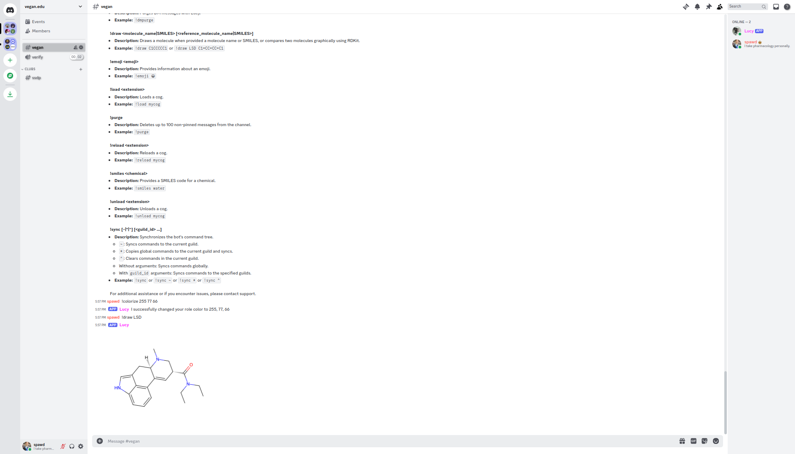

# Lucy Bot

Lucy is a versatile Discord bot designed for managing molecular structures, interacting with emojis, and more. This README will guide you through setting up and running Lucy, including environment setup.

## Features

- **Colorize Role:** Change your role color with RGB values.
- **DMPurge:** Purge DM messages with the bot.
- **Draw:** Draw molecules or compare them graphically using RDKit.
- **Emoji Info:** Get information about emojis.
- **Load/Unload Cogs:** Dynamically load and unload bot cogs.
- **Purge:** Remove non-pinned messages from channels.
- **Reload:** Reload bot cogs.
- **SMILES:** Retrieve SMILES codes for chemicals.
- **Sync:** Synchronize the bot's command tree.

## Requirements

- Python 3.8+
- `discord.py` library
- `requests` library
- `emoji` library
- `pubchempy` library
- `rdkit` library
- `pillow` library

## Installation

### Step 1: Create a Discord Application

1. Go to the [Discord Developer Portal](https://discord.com/developers/applications).
2. Click on the "New Application" button.

   

3. Enter a name for your application and click "Create".

   

### Step 2: Create a Bot

1. In your new application's settings, navigate to the "Bot" tab on the left sidebar.
2. Click on the "Reset Token" button.

   

3. Confirm by clicking "Yes, do it!".

   

4. Your bot is now created. You can customize its username and avatar here if you like.

   

### Step 3: Setup Privileged Intents

1. In Bot, there is a "Privileged Intents section". Click enable on the MESSAGE CONTENT INTENT.

   

### Step 4: Get Your Bot's Token

1. Under the Bot tab, you will see a "Token" section. Click "Copy" to copy your bot's token. Keep this token secure and do not share it with anyone.

   

### Step 5: Invite Your Bot to a Server

1. Navigate to the "Installation" tab on the left sidebar.
2. Under the "Default Install Settings" section for "Guild Install", select the "bot" scope.
3. Scroll down to the "Bot Permissions" section and select the permissions your bot will need. For basic functionality, you can start with the following permissions:
   - Read Messages/View Channels
   - Send Messages
   - Manage Messages (for purge commands)
   - Embed Links
   - Attach Files
   - Read Message History
   - Use External Emojis

   

4. Copy the generated URL and open it in a new browser tab. Select the server you want to add your bot to and click "Authorize".

   

### Step 6: Set Up Your Bot Locally

1. Clone the repository containing your bot's code:
   
   ```bash
   git clone https://github.com/brandongrahamcobb/py.git
   mv py Lucy
   cd Lucy
   ```

2. Run the setup script:

   ```bash
   python setup.py
   ```

   During setup, you will be prompted to enter your Discord bot token if it is not already present in `config.json`.

### Step 6: Run Your Bot

1. To start your bot, run the `main.py` script:

   ```bash
   python main.py
   ```

### Step 7: Verify Your Bot is Online

1. Check your Discord server to see if your bot is online and responding to commands.

   

## Commands

Here are the commands you can use with the bot:

- **!colorize <R> <G> <B>**: Change your role color with red, green, and blue values.
- **!dmpurge**: Purge DM messages with the bot (Luc).
- **!draw <MOLECULE> or !draw <MOLECULE1> <MOLECULE2>**: Draw a molecule or compare two molecules using RDKit.
- **!emoji <emoji>**: Get information about a given Unicode emoji character.
- **!load <extension>**: Load a cog.
- **!purge**: Delete non-pinned messages from the channel.
- **!reload <extension>**: Reload a cog.
- **!smiles <chemical>**: Retrieve the SMILES code for a chemical.
- **!unload <extension>**: Unload a cog.
- **!sync [~ | * | ^]**: Synchronize the bot's command tree globally or to the current guild.

## Environment Setup

The `setup.py` script performs the following:

- **System Update (Linux):** If running as root on Linux, updates the system using `pacman`.
- **Virtual Environment:** Creates a virtual environment if it doesn't exist.
- **Dependencies:** Installs required Python packages into the virtual environment.
- **Directory Creation:** Ensures necessary directories are created.
- **Token Setup:** Prompts for a Discord bot token if it is not present in `config.json`.

### Setup Script

Here's the setup script (`setup.py`) that handles environment setup and token configuration:

## Main Script

Here's the main script (`main.py`) for running the bot:

